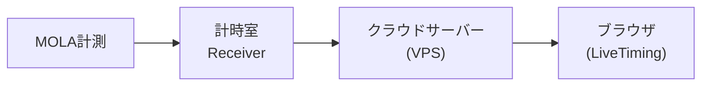
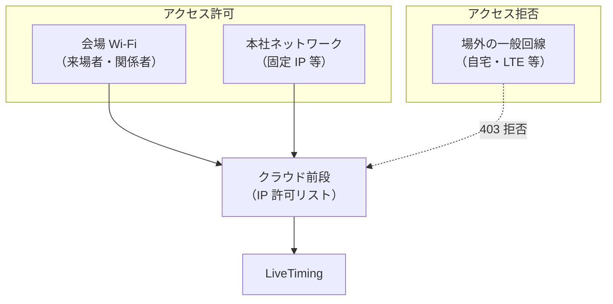
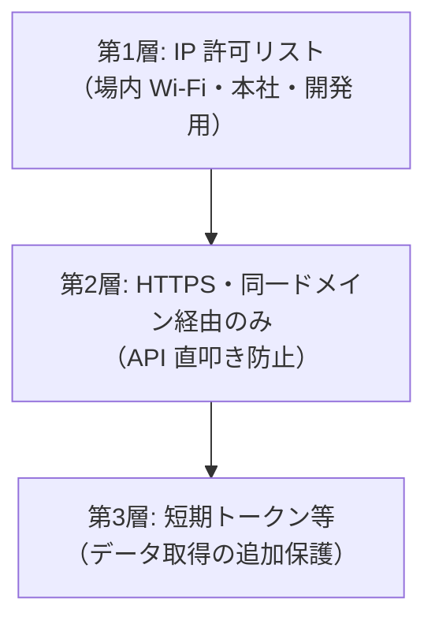

# 岡山国際サーキット LiveTiming 閲覧制限 — 技術メモ・詳細版

> **先方提出用の正式な提案書**は [提案書_LiveTiming_閲覧制限_提出用.md](./提案書_LiveTiming_閲覧制限_提出用.md) をご利用ください。  
> 本ファイルは、提出用文案の根拠となる技術比較・社内メモを含む詳細版です。

**作成日**: 2026年5月26日  
**対象**: 岡山国際サーキット 御中  
**件名**: LiveTiming（ブラウザ閲覧）のアクセス制御方式について

---

## 1. 背景・ご要望の整理

LiveTiming はスマートフォン・タブレット・PC の**ウェブブラウザのみ**で閲覧する想定です。  
以下の要件を同時に満たす必要があります。

| 要件 | 内容 |
|------|------|
| ① 場内での閲覧 | サーキット場内にいる関係者・来場者が、特別なアプリなしでブラウザから閲覧できる |
| ② 本社での閲覧 | 岡山市内の本社（サーキットから離れた拠点）からも同様に閲覧できる |
| ③ 場外からの遮断 | 一般の方が自宅・モバイル回線など、場外から URL を知っていても閲覧できない |

本提案では、上記を満たしつつ**運用負荷・コスト・確実性**のバランスが取れる方式を推奨案としてご提示します。

---

## 2. システムの前提（参考）

- 計測データはクラウド上のサーバーに集約し、ブラウザは **HTTPS** でページを開き、**WebSocket** でリアルタイム表示します。
- アクセス制御は、**ブラウザに入る前（サーバー・ネットワーク側）** で行うのが最も確実です。
- アプリのインストールや専用クライアントは不要です。

---

## 3. 推奨方式：会場 Wi‑Fi ＋ 本社 IP 許可（ハイブリッド）

### 3.1 概要

| 閲覧場所 | 制御の考え方 |
|----------|----------------|
| **サーキット場内** | 会場用 Wi‑Fi（またはサーキット管理下のネットワーク）に接続した端末のみ、LiveTiming の URL にアクセス可能 |
| **本社（岡山市内）** | 本社オフィスからインターネットに出る際の**固定 IP アドレス**（または VPN 経由の固定出口）をあらかじめ登録し、同様にアクセス可能 |
| **場外** | 上記以外の接続元は、ページ・データ通信ともに**拒否**（エラー画面を表示） |

### 3.2 来場者の使い方（イメージ）

1. 会場に掲示された **LiveTiming 専用 Wi‑Fi**（または案内された会場 Wi‑Fi）に接続する  
2. ブラウザで表示された URL（または QR コード）を開く  
3. そのままタイミング画面が表示される（アプリ不要）

※ 会場 Wi‑Fi に接続せず **携帯電話の LTE/5G のみ**で閲覧する場合、通信事業者の IP アドレスは場所に依存せず、**場内にいても場外と区別できない**ことがあります。確実に場内限定にするには、**「閲覧時は会場 Wi‑Fi をご利用ください」**の案内を併用することを推奨します。

### 3.3 本社の使い方（イメージ）

1. 本社の通常のオフィス PC・社内 Wi‑Fi から、同じ URL を開く  
2. 事前に登録した本社の出口 IP からのアクセスのみ許可するため、追加の操作は不要（固定 IP が取れる場合）

本社で固定 IP がない場合は、**本社 PC 用の VPN**（サーキット既存の遠隔接続と同系統でも可）を用意し、その VPN 出口 IP を許可リストに登録する方法があります。

### 3.4 メリット・デメリット

| メリット | デメリット |
|----------|------------|
| ブラウザのみで完結 | 会場 Wi‑Fi の準備・出口 IP の確認が必要 |
| 場外からの不正閲覧を強く抑制できる | 開催前に IP リストの更新作業が必要 |
| 本社を別手段（GPS 等）なしで確実に含められる | LTE のみの来場者は Wi‑Fi 案内が必要 |
| 専用アプリ・会員登録が不要 | |

---

## 4. その他の方式（参考比較）

### 4.1 イベント共通パスワード

- **内容**: URL を開いたあと、画面でパスワード入力  
- **長所**: 導入が早い、本社・場内とも同じ手順  
- **短所**: SNS 等でパスワードが拡散すると場外からも閲覧可能になりやすい  
- **評価**: 補助手段にはなるが、**主たる制御手段としては非推奨**

### 4.2 全員 VPN 必須

- **内容**: 閲覧前に VPN 接続を必須とする  
- **長所**: 本社・関係者向けには強固  
- **短所**: 来場者・観客には操作が煩雑  
- **評価**: **関係者限定**の運用向け。一般来場者向けには非推奨

### 4.3 ブラウザによる位置情報（GPS）チェック

#### 技術的には可能か

**はい、ブラウザのみでも技術的には可能です。**

- スマートフォン等では、HTML5 の **位置情報 API（Geolocation API）** により、端末の GPS・基地局・Wi‑Fi 位置推定を利用できます。
- 初回アクセス時にブラウザが **「位置情報の使用を許可しますか？」** とユーザーに確認します（許可しないと判定できません）。

#### 実務上の限界（推奨しない理由）

| 項目 | 説明 |
|------|------|
| ユーザー拒否 | 「許可しない」を選ぶと閲覧不可。サポート問い合わせが増える |
| 精度 | 屋内・スタンド裏では誤差が大きい。境界付近で誤判定しやすい |
| 改ざん | 開発者向け機能等で**偽の位置を送れる**端末があり、セキュリティ境界として弱い |
| PC（本社） | デスクトップは GPS を持たないことが多く、**IP ベースの粗い推定**に頼る場合があり、本社・場外の区別が不安定 |
| プライバシー | 位置情報の取得・利用について、掲示・同意の整理が必要 |
| 運用 | ジオフェンス（円形範囲）の半径調整、誤判定時の対応が発生 |

**結論**: GPS は「補助的な UX（会場付近かどうかの目安）」には使えますが、**場外遮断の主手段としては推奨しません。**  
本社を含む確実な制御には、**ネットワーク（Wi‑Fi / 固定 IP / VPN）による制御**が適しています。

### 4.4 比較一覧

| 方式 | 場内 | 本社 | 場外遮断 | 来場者の使いやすさ | 推奨度 |
|------|:----:|:----:|:--------:|:------------------:|:------:|
| **会場 Wi‑Fi ＋ 本社 IP 許可** | ◎ | ◎ | ◎ | ◎ | **◎ 推奨** |
| 共通パスワード | ○ | ○ | △ | ◎ | △ 補助のみ |
| 全員 VPN | △ | ◎ | ◎ | × | △ 関係者限定向け |
| GPS のみ | △ | △ | △ | △ | × 非推奨 |
| 秘密 URL のみ | △ | △ | × | ◎ | × 非推奨 |

※ 推奨案では、不正利用防止のため **API・WebSocket に対する追加保護**（接続元検証・短期トークン等）を併用します。これは閲覧者の操作負担は増やしません。

---

## 5. 推奨構成の詳細（実装イメージ）

### 5.1 多層の考え方

- **第1層**で「場内・本社か、それ以外か」を判定（本提案の核心）
- **第2・3層**で、URL が漏洩した場合のデータ不正取得を抑止

### 5.2 御社にご確認いただきたい事項

| # | 確認項目 | 用途 |
|---|----------|------|
| 1 | 会場で **LiveTiming 専用 Wi‑Fi**（または既存ゲスト Wi‑Fi の VLAN）を用意できるか | 場内閲覧の主経路 |
| 2 | その Wi‑Fi の **インターネット出口 IP**（固定 or 変動） | 許可リスト登録 |
| 3 | 本社の **固定グローバル IP** の有無、または VPN の利用可否 | 本社閲覧 |
| 4 | 想定閲覧者（観客全員 / 関係者・メディアのみ 等） | Wi‑Fi 案内の要否 |
| 5 | 開催外のテスト閲覧（計時室・開発側 IP の一時許可） | リハーサル運用 |

### 5.3 開催日の運用フロー（案）

1. **開催 1〜2 週間前**: 会場 Wi‑Fi・本社の出口 IP を計測し、許可リストに登録  
2. **開催当日**: 会場掲示・公式告知で「LiveTiming は ○○ Wi‑Fi 接続後、URL／QR から」と案内  
3. **開催中**: 許可外 IP からのアクセス試行はログで監視（必要に応じてリスト微調整）  
4. **開催終了後**: 一時的に追加した IP を削除（常時本社のみ残す等は御社方針に応じて）

---

## 6. ご提案のまとめ

1. **主方式**: サーキット場内は **会場 Wi‑Fi 経由**、本社は **固定 IP（または VPN 出口）** をクラウド側の許可リストに登録し、それ以外は閲覧不可とする。  
2. **ブラウザのみ**で利用可能で、専用アプリは不要。  
3. **GPS による位置チェック**はブラウザだけでも実装可能だが、拒否・誤差・改ざん・本社 PC での不安定さから、**主手段には採用しない**ことを推奨する。  
4. 必要に応じて、関係者向けの**限定パスワード**を第2層として併用することは可能（来場者全員向けの主制御にはしない）。

---

## 7. 次のステップ

1. 本提案内容のご確認・ご要望のフィードバック  
2. 上記「ご確認事項」について情報共有（Wi‑Fi 体制・本社 IP 等）  
3. 確定後、開発計画へアクセス制御仕様を反映し、Phase 2（サーバー構築）で実装  

ご不明点・ご要望（例: LTE でも場内閲覧を必須にしたい 等）がございましたら、お知らせください。要件に応じて代替案を追記いたします。

---

**（社内メモ・RFX 用）**

- 開発計画書 §6 の「一般公開」は、インターネット全開放ではなく「許可されたネットワークからの公開閲覧」に読み替えて更新予定。  
- Receiver の LAN 直結 WebSocket（ピット内）とは別経路。観客向けはクラウド URL + IP 制御が前提。
