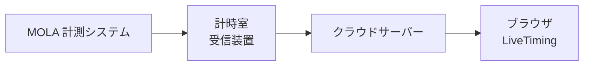
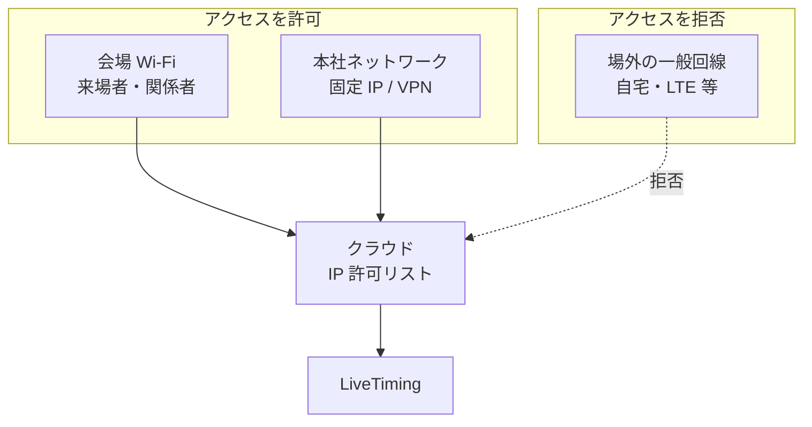
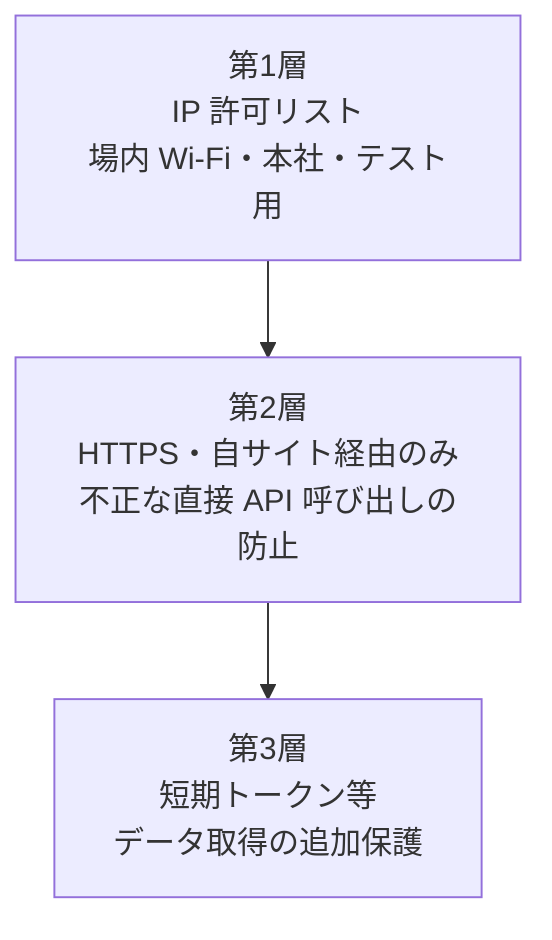

# ご提案書

## 岡山国際サーキット LiveTiming  
## 閲覧制限（アクセス制御）の方式について

| 項目 | 内容 |
|------|------|
| 提出日 | 2026年5月26日 |
| 提出先 | 岡山国際サーキット 御中 |
| 件名 | LiveTiming（ブラウザ閲覧）のアクセス制御方式のご提案 |
| 文書番号 | （貴社管理用） |
| 提案者 | （貴社との契約主体名・担当者名を記載） |

---

## はじめに

平素より格別のご高配を賜り、厚く御礼申し上げます。

このたびは、岡山国際サーキット向け **LiveTiming**（リアルタイムタイミング表示）について、**サーキット場内および本社からの閲覧を可能としつつ、場外からの一般閲覧を制限する** 仕組みにつき、実現方式のご提案を申し上げます。

本 LiveTiming は **スマートフォン・タブレット・PC のウェブブラウザのみ** でご利用いただく想定であり、専用アプリのインストールは不要です。

ご検討のほど、何とぞよろしくお願い申し上げます。

---

## 1. エグゼクティブサマリー

| 項目 | 内容 |
|------|------|
| **ご要望** | ① 場内での閲覧 ② 岡山市内本社での閲覧 ③ 場外（一般回線）からの遮断 |
| **ご提案（推奨）** | **会場 Wi‑Fi ＋ 本社固定 IP（または VPN 出口）** をクラウド側で許可し、それ以外は拒否 |
| **閲覧手段** | ブラウザのみ（アプリ不要） |
| **GPS 位置チェック** | ブラウザのみでも技術的には可能だが、**主手段としては非推奨**（詳細は第5章） |
| **御社にご協力いただくこと** | 会場 Wi‑Fi の出口 IP 確認、本社出口 IP（または VPN）の共有 |

推奨方式により、**場外から URL を知っていても閲覧できない** 状態を、ネットワーク単位で確実に実現できます。来場者には会場 Wi‑Fi 接続後に URL または QR コードからアクセスいただく運用を想定しています。

---

## 2. 背景と目的

### 2.1 背景

LiveTiming は、MOLA 計測システムから送信されるタイミングデータをクラウド上で集約し、ブラウザへリアルタイム配信するサービスです。競技関係者・来場者・本社スタッフが、開催中の順位・ラップタイム等を参照できます。

一方、計測データや表示内容を **インターネット上で無制限に公開することは望ましくない** というご意向をいただいており、閲覧可能な範囲を次のとおり整理いたしました。

### 2.2 目的

| # | 目的 |
|---|------|
| 1 | サーキット **場内** にいる方が、手軽にブラウザで LiveTiming を閲覧できること |
| 2 | **本社**（岡山市内・サーキットから離れた拠点）からも、同様に閲覧できること |
| 3 | **場外**（自宅・一般のモバイル回線等）からは、URL を知っていても閲覧できないこと |
| 4 | 上記を満たしつつ、来場者の操作負担・運用負荷を最小化すること |

### 2.3 システム構成（参考）

計測データは計時室の受信装置からクラウドサーバーへ送信され、閲覧者のブラウザは HTTPS および WebSocket でデータを受け取ります。

アクセス制御は、**データがブラウザに届く前（クラウドサーバーおよびその前段）** で実施するのが最も確実です。ブラウザ上だけの制御に頼る方式は、回避されやすいため、本提案では採用しません。

---

## 3. ご提案内容（推奨方式）

### 3.1 方式名称

**「会場 Wi‑Fi ＋ 本社 IP 許可」方式（ハイブリッド型ネットワーク制御）**

### 3.2 制御の考え方

接続元の **インターネット出口 IP アドレス** が、事前に登録された許可リストに含まれる場合のみ、LiveTiming のページおよびリアルタイムデータへのアクセスを許可します。リストにない接続元からのアクセスは、ページ表示・データ取得のいずれも拒否します。

| 閲覧場所 | 許可の仕組み |
|----------|----------------|
| **サーキット場内** | 会場用 Wi‑Fi（または貴社管理下の会場ネットワーク）の出口 IP を許可リストに登録 |
| **本社（岡山市内）** | 本社オフィスからの固定グローバル IP、または VPN 出口 IP を許可リストに登録 |
| **場外** | 上記に該当しない接続元は **すべて拒否** |

### 3.3 来場者・関係者のご利用イメージ（場内）

1. 会場掲示または公式告知で案内された **LiveTiming 用 Wi‑Fi**（または指定の会場 Wi‑Fi）に接続する  
2. ブラウザで **URL を開く**、または会場に掲示された **QR コード** を読み取る  
3. タイミング画面が表示され、開催中は自動更新される  

**アプリのインストール・会員登録・パスワード入力は不要** です（推奨方式を単独で運用する場合）。

#### 携帯電話の LTE / 5G のみで閲覧する場合について

会場 Wi‑Fi を使わず、携帯キャリアの回線のみでアクセスした場合、通信の出口 IP は **所在地と無関係** に割り当てられることがあり、**場内にいても「場外」と同じ扱いになり閲覧できない** 場合があります。

場内閲覧を確実にするため、次の運用を **併用することを推奨** いたします。

- 会場内の掲示・放送・公式サイト等で  
  **「LiveTiming のご覧になり方：会場 Wi‑Fi（○○）に接続のうえ、URL / QR からアクセス」**  
  と明記する

### 3.4 本社でのご利用イメージ

1. 本社の通常の PC・社内 Wi‑Fi から、場内と **同じ URL** を開く  
2. 事前に登録した本社の出口 IP からのアクセスのため、**追加の操作は不要**（固定 IP が取得できる場合）

本社回線に固定 IP がない場合は、**本社向け VPN** の出口 IP を許可リストに登録する方法があります。貴社で既にご利用中の遠隔接続用 VPN と同系統の運用も可能です。

### 3.5 推奨方式の特長

| 観点 | 内容 |
|------|------|
| **確実性** | 場外からの無許可閲覧を、ネットワーク単位で強く抑制できる |
| **本社対応** | GPS 等に頼らず、本社を確実に許可リストに含められる |
| **利用のしやすさ** | ブラウザのみ。来場者は Wi‑Fi 接続後 URL を開くだけ |
| **コスト** | 専用アプリ・大規模な認証基盤は不要 |
| **留意点** | 会場 Wi‑Fi の準備、開催前の IP 確認・登録作業が必要 |

---

## 4. セキュリティ構成（推奨方式に加える保護）

閲覧制限（第1層）に加え、URL や API が第三者に直接利用されることを防ぐため、次の保護を **あわせて実装** することを推奨します。いずれも **閲覧者の操作負担は増やしません**。

| 層 | 役割 |
|----|------|
| 第1層 | **閲覧場所の制限**（本提案の核心） |
| 第2層 | 許可されたクライアントからのみ API・WebSocket を受け付ける |
| 第3層 | トークン期限等により、漏洩した接続情報の悪用を困難にする |

---

## 5. その他の方式について（参考・比較）

ご検討の参考として、代替方式を比較いたします。

### 5.1 方式比較一覧

| 方式 | 場内 | 本社 | 場外遮断 | 来場者の使いやすさ | 総合評価 |
|------|:----:|:----:|:--------:|:------------------:|:--------:|
| **会場 Wi‑Fi ＋ 本社 IP 許可** | ◎ | ◎ | ◎ | ◎ | **◎ 推奨** |
| イベント共通パスワード | ○ | ○ | △ | ◎ | △ 補助向け |
| 全員 VPN 必須 | △ | ◎ | ◎ | × | △ 関係者限定向け |
| ブラウザ GPS のみ | △ | △ | △ | △ | × 非推奨 |
| 推測困難な秘密 URL のみ | △ | △ | × | ◎ | × 非推奨 |

### 5.2 イベント共通パスワード

画面表示時にパスワード入力を求める方式です。導入は容易ですが、SNS 等での拡散により **場外からも閲覧可能になるリスク** があります。関係者向けの **補助的手段** としては検討可能ですが、主たる制御手段としては推奨しません。

### 5.3 全員 VPN 必須

閲覧前に VPN 接続を必須とする方式です。本社・関係者向けには有効ですが、一般来場者には **操作が煩雑** です。観客全員向けの LiveTiming には適しません。

### 5.4 ブラウザによる位置情報（GPS）チェック

#### 技術的な可否

**ブラウザのみでも、技術的には実装可能です。**

スマートフォン等では、ウェブ標準の **位置情報 API（Geolocation API）** により、GPS・基地局・周辺 Wi‑Fi 情報等から位置を取得できます。HTTPS での配信が前提となり、初回アクセス時にブラウザから **「位置情報の使用を許可しますか」** と利用者に確認が表示されます。

#### 主手段として推奨しない理由

| 項目 | 説明 |
|------|------|
| 利用者の拒否 | 「許可しない」を選択された場合、閲覧不可となり、会場での問い合わせが増える |
| 精度 | 屋内・スタンド付近では誤差が大きく、境界付近で誤判定が起きやすい |
| 信頼性 | 一部環境では位置情報の改ざんが可能であり、**厳密なアクセス制御には不向き** |
| 本社 PC | デスクトップ PC は GPS を持たないことが多く、粗い位置推定に依存し、本社要件を安定して満たしにくい |
| プライバシー | 位置情報の取得・利用に関する掲示・同意の整理が必要 |
| 運用 | ジオフェンス（許可範囲）の調整、誤判定時の対応が発生する |

**結論**  
GPS によるチェックは、会場付近かどうかの **参考表示** には利用し得ますが、**場外遮断および本社閲覧を含むアクセス制御の主手段としては推奨いたしません。** 本提案どおり、**ネットワーク（会場 Wi‑Fi・本社 IP / VPN）による制御** を主とする構成をお勧めします。

---

## 6. 御社にご確認・ご協力いただきたい事項

方式の確定および実装にあたり、下表のご確認をお願いいたします。

| # | 確認事項 | ご確認の目的 |
|---|----------|----------------|
| 1 | 会場で **LiveTiming 専用 Wi‑Fi**、または既存ゲスト Wi‑Fi の **専用 VLAN** を用意できるか | 場内閲覧の主経路 |
| 2 | 上記 Wi‑Fi の **インターネット出口 IP**（固定または変動の有無） | 許可リストへの登録 |
| 3 | 本社の **固定グローバル IP** の有無、または **VPN** の利用可否 | 本社からの閲覧 |
| 4 | 想定される閲覧者（観客全員 / 関係者・メディア限定 等） | 会場 Wi‑Fi 案内の要否・範囲 |
| 5 | 開催前の **テスト閲覧**（計時室・関係者拠点の IP 一時許可）の要否 | リハーサル・事前確認 |

上記が確定次第、許可リストの設計および LiveTiming サーバー側の実装仕様に反映いたします。

---

## 7. 導入・運用の流れ（案）

| 時期 | 作業内容 | 担当イメージ |
|------|----------|----------------|
| **方式確定後** | 会場 Wi‑Fi・本社の出口 IP を確認し、許可リストの設計 | 貴社（ネットワーク）／開発側（サーバー設定） |
| **開催 1〜2 週間前** | 出口 IP の再計測・許可リストへの登録、テスト閲覧 | 双方 |
| **開催当日** | 会場掲示・QR コード・公式告知による Wi‑Fi 接続の案内 | 貴社（運営・広報） |
| **開催中** | 許可外からのアクセス試行の監視、必要に応じた IP 微調整 | 開発側（監視）／貴社（問い合わせ対応） |
| **開催終了後** | 一時登録 IP の整理（本社 IP の常時許可の要否は貴社方針に応じる） | 開発側 |

---

## 8. ご提案のまとめ

1. **推奨方式**として、**会場 Wi‑Fi 出口 IP ＋ 本社固定 IP（または VPN 出口）** による許可リスト方式をご提案いたします。  
2. 閲覧は **ウェブブラウザのみ** で完結し、専用アプリは不要です。  
3. **GPS による位置チェック**はブラウザのみで実装可能ですが、精度・拒否・改ざん・本社 PC での不安定さ等から、**主手段には採用しない** ことを推奨いたします。  
4. IP 制限に加え、API・WebSocket に対する **多層の保護** を実装し、URL 漏洩時の不正利用も抑止します。  
5. 場内閲覧の確実性のため、**会場 Wi‑Fi 接続の案内** を運用面で併用することを推奨いたします。

---

## 9. 今後の進め方

1. 本ご提案内容のご確認およびご意見・ご要望のフィードバック  
2. 第6章「ご確認事項」に関する情報の共有（Wi‑Fi 体制・本社 IP 等）  
3. 確定内容に基づき、LiveTiming 開発計画へアクセス制御仕様を反映し、サーバー構築フェーズで実装  

ご要望（例：LTE 回線でも場内閲覧を必須としたい、関係者向けにパスワードを併用したい 等）がございましたら、お知らせください。要件に応じて代替案・追記をご提示いたします。

---

以上

| | |
|---|---|
| 提案者 | |
| 担当者 | |
| 連絡先 | |
| 印 | |

---

### 添付・関連資料（社内管理用）

- 技術メモ・詳細比較: [提案書_LiveTiming_閲覧制限.md](./提案書_LiveTiming_閲覧制限.md)
- 開発計画: [開発計画_LiveTiming_OKAYAMA.md](./開発計画_LiveTiming_OKAYAMA.md)
