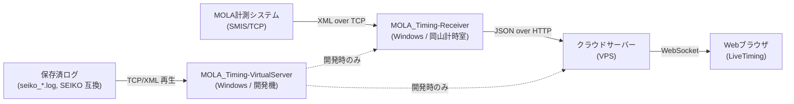
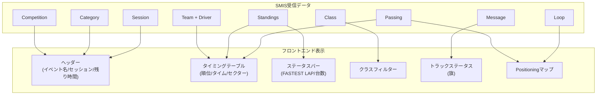
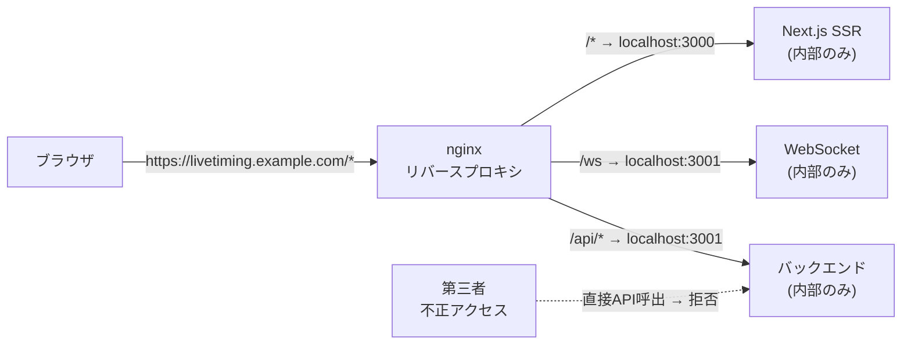

# 岡山国際サーキット LiveTiming ページ開発計画

作成日: 2026年5月7日

---

## 1. システム全体像



> **命名規則**: 対外的なアプリ名は **MOLA_Timing-Receiver** / **MOLA_Timing-VirtualServer**。
> 内部のプロトコル・ソースコード・型定義は仕様書通り **SMIS** を使用する。
> 詳細仕様は [開発計画_SMIS_Receiver_VirtualServer.md](開発計画_SMIS_Receiver_VirtualServer.md) を参照。

### 1.1 SMIS プロトコル概要 (計測データ仕様書_20200220.pdf)

- **通信方式**: TCP ソケット通信 (一方向配信、ハンドシェイクなし)
- **データ形式**: XML (UTF-8)、データ終端は NULL (0x00)
- **タイム単位**: 1/10000秒 (例: `935910` = 1'33.5910)

#### データ分類

- **マスターデータ** (接続時・変更時に送信)
  - `Competition` -- 競技会名 (日/英)、開催日
  - `Category` -- カテゴリー名、コース名、コース長 (cm)
  - `Round` -- ラウンド名、レース区分 (T:タイムレース / L:周回レース)
  - `Group` -- 組情報
  - `Session` -- セッション名、最大時間/周回数
  - `Class` -- クラス名 (例: GT-500/GT-300)、コースレコード
  - `Team` -- ゼッケン、チーム名、エンジン、マシン、タイヤ、国名 + `Driver`子要素
  - `Transponder` -- トランスポンダー番号

- **計測ポイントデータ** (セッション選択時に送信)
  - `Loop` -- ID (0:コントロールライン / 1-3:セクター / 8-9:スピード / 10:ピットアウト / 11:ピットイン / 20:CL-ピット)

- **計測データ** (リアルタイム送信)
  - `Select` -- セッション選択
  - `Start` -- スタート日時
  - `Passing` -- 通過タイム (LoopID, Time, TeamID, DriverNo, Type[N/B/M/C/E])
  - `Standings` -- 順位 (Position, ClassPosition, Lap, BestTime, LastLapTime, SectorNo, SectorTime)

- **メッセージデータ**
  - `Message` -- Type (I:Info / P:Penalty / T:Track)、Scope (E:関係者 / A:全員)、Text

---

## 2. デザイン方針

### 2.1 Alkamelsystemsとの差別化o

機能・情報レイアウトは参考にするが、ビジュアルデザインは独自のものにする。

**参考にする部分（機能面のみ）**
- カラム構成（P / PIC / Nr / Class / Driver 等）
- カラーコーディング（マゼンタ/シアン/イエロー）はモータースポーツの国際標準
- ページ構成（Timing / Positioning / Schedule & Results）

**差別化する部分（ビジュアル面）**
- 背景: ヘキサゴンパターンは使わない → グラデーション or フラットダーク
- ヘッダー: Alkamelsystemsと異なるレイアウト・形状
- テーブル行: 独自のスタイリング（角丸、ホバー効果等）
- サイドメニュー: 独自デザイン
- フォント / カラーパレット: 独自選定
- ステータスバー: 独自レイアウト

### 2.2 ブランディング

- **RFX Timingの名称・ロゴは一切表示しない**（下請けとしての存在は非公開）
- ヘッダー右側: **MOLA** のロゴ・名称を表示
- ヘッダーまたはフッター: **岡山国際サーキット** の名称を表示
- ロゴ画像は後日差し替え可能な設計にする（仮ロゴで作成）

### 2.3 デザインスタイル

- プロフェッショナルなダークテーマをベースに、作りながら調整していく
- 深い紺・ダークグレーベース、シャープなライン
- 視認性重視（タイミングデータが最も見やすいこと）

### 2.4 コースマップ

- **SVG形式で岡山国際サーキットのコース形状を描画**
- セクター別の色分け表示（S1/S2/S3）
- 計測ポイント（FL/S1/S2/S3/PitIn/PitOut）のラベル表示
- Phase 4のPositioningで車両位置をSVG上に配置可能
- 拡大・縮小対応

---

## 3. 参考: Alkamelsystems UI仕様 (スクリーンショット分析)

### 3.1 ページ構成 (サイドメニュー)

- **Timing** -- メインのタイミングテーブル
- **Positioning** -- コースマップ上の車両位置
- **Schedule & Results** -- スケジュール・過去リザルト
- **Help** -- 色分けルール等の説明

### 3.2 Timingページ

**ヘッダー部**
- 左: 残り時間 (大きなカウントダウン表示)
- 中央: イベント名 | カテゴリ | セッション名
- 右: ブランドロゴ + 現在時刻
- トラックステータス: FCY / Green / Yellow / Red / White / Black / Chequered

**タイミングテーブルのカラム**
- P (総合順位) / PIC (クラス内順位) / Nr (ゼッケン) / Class / Driver / Car or Team
- Laps / Gap (トップとの差) / Best (ベストタイム) / S1 / S2 / S3 / Pits

**左サイドパネル**
- Overall / Top 10 フィルター
- クラス別フィルタボタン (クラス色付き)
- Select Participants / Clear Selected

**下部ステータスバー**
- FASTEST LAP: カーNo + タイム + ベストセクター (S1/S2/S3/IL)
- ON TRACK / IN PIT / STOPPED / RETIRED の台数
- 気温 / 路面温度 / 湿度 / 風速 / 気圧
- RC (レースコントロール) ボタン

**色分けルール**
- マゼンタ: 全体ベスト
- シアン: 自己ベスト
- イエロー: 現在タイム (更新なし)
- ポジション背景色: オレンジ(ピットアウト) / ブルー(ピット内) / レッド(停車) / ブラック(走行中)

### 3.3 Positioningページ

- コースマップ上に車両番号がクラス色付きで表示
- セクター色分け表示 (S1/S2/S3を色別に)
- FL/SCL/i1/i2/TS 等の計測ポイントラベル
- PIT エリアにピット中の車両一覧

### 3.4 Schedule & Results

- Event / Session / Localtime / Results のテーブル
- 各行にResultsボタン (PDF結果へのリンク)

---

## 4. SMISデータ → フロントエンド表示のマッピング



---

## 5. 技術スタック

| 項目 | 技術 |
|------|------|
| フロントエンド | Next.js 15 (React 19) + TypeScript |
| スタイリング | Tailwind CSS v4 (ダークテーマベース) |
| リアルタイム通信 | ネイティブ WebSocket |
| バックエンドAPI | Node.js + Express |
| クラウド DB | SQLite (better-sqlite3) -- 日付別ファイル運用 |
| MOLA_Timing-Receiver | .NET 10 + WPF (C#) / SMIS TCP クライアント + XMLパーサー + ローカル WS サーバー |
| MOLA_Timing-VirtualServer | .NET 10 + WPF (C#) / 保存ログ再生 TCP サーバー |
| Windows ローカル DB | SQLite (Microsoft.Data.Sqlite) -- 設定・メタ・ミラー |
| デプロイ先 | VPS (nginx reverse proxy) |
| 状態管理 | React Context + useReducer |

**選定理由**:
- リアルタイム更新が必要なテーブル UI には React の Virtual DOM が最適。
- Windows 計時室向けの常駐アプリ（Receiver / VirtualServer）は信頼性・ネイティブ統合を重視し .NET 10 (LTS) + WPF を採用。Socket.IO に依存せずネイティブ WebSocket で配信することで、C# と TypeScript の両側からシンプルに扱える。

---

## 6. セキュリティ設計 (データ保護)

ページは一般公開するが、APIエンドポイントやWebSocket接続先を第三者に不正利用されないようにする。



### 6.1 多層防御アプローチ

**Layer 1: nginx リバースプロキシ (エンドポイント隠蔽)**
- バックエンドサーバーのIPアドレス・ポートを外部に公開しない
- 全トラフィックを `https://livetiming.example.com` の単一ドメインに集約
- バックエンドは `localhost` のみリッスン (外部から直接到達不可)
- ブラウザのDevToolsで見えるのは同一ドメインのパスのみ (`/api/*`, `/ws`)

**Layer 2: Origin / Referer 検証**
- WebSocket接続時に `Origin` ヘッダーを検証 (自ドメインのみ許可)
- REST APIに `Referer` チェック追加
- CORS設定で `Access-Control-Allow-Origin` を自ドメインのみに限定

**Layer 3: 短期トークン認証 (サーバーサイド発行)**
- Next.js SSRのページ生成時にサーバーサイドで短期有効トークンを埋め込む
- WebSocket接続時にこのトークンを送信 → サーバー側で検証
- トークンは数分で有効期限切れ → DevToolsで取得しても再利用困難
- トークンはHTMLに埋め込むがJSソースには含めない (SSR利点)
- **サーバー側がトークン有効期限切れ前に新トークンをWebSocket経由で自動プッシュ** → 正規ユーザーは途切れず視聴継続

**Layer 4: Rate Limiting (レート制限)**
- nginx `limit_req` でIP単位のリクエスト制限
- WebSocket接続数の上限設定
- 異常な接続パターンを検出 → 自動ブロック

**Layer 5: ビルド時難読化**
- Next.js本番ビルドによる自動ミニファイ + webpack難読化
- ソースマップ (.map) は本番環境にデプロイしない
- 環境変数はサーバーサイドのみ (`NEXT_PUBLIC_` プレフィックスを使わない)

**Layer 6: データ加工**
- クライアントに送るデータはフロントエンド表示に必要な項目のみに限定
- SMIS生データ (XML) はクライアントに一切渡さない
- 内部IDやサーバー構成が推測できるデータは除去

### 6.2 Phase別のセキュリティ実装タイミング

- **Phase 1** (フロントエンドのみ): ダミーデータのため未適用 (ソースマップ除外、ビルド難読化のみ)
- **Phase 2** (バックエンド構築時): Layer 1-6 の全て実装
- **Phase 3** (SMIS連携時): 受信アプリ → クラウドサーバー間も共有シークレットで認証

### 6.3 WebSocket切断時のフォールバック

- **自動再接続**: 切断検知後、指数バックオフでリトライ (1秒 → 2秒 → 4秒...)
- **再接続時フルデータ再送**: 現在の全Standingsを一括送信 → 即座に最新状態に復帰
- **ユーザー通知**: 切断中は画面上部に「接続再試行中...」バナーを表示、復帰後に自動消去

---

## 7. フェーズ構成

### Phase 1: フロントエンドUI (ダミーデータ)

SMIS仕様に準拠した型定義を使い、独自デザインのUIを完成させる。

**1-1. プロジェクト初期セットアップ**
- Next.js + TypeScript + Tailwind CSS プロジェクト作成
- SMIS仕様に基づくTypeScript型定義 (Competition, Category, Session, Class, Team, Driver, Standing, Passing, Message等)
- ディレクトリ構造の設計

**1-2. タイミングテーブル (メインビュー)**
- ヘッダー: イベント名 / セッション名 / 残り時間カウントダウン / トラックステータス(旗) / ロゴ / 現在時刻
- テーブルカラム: P / PIC / Nr / Class / Driver / Team (Car) / Laps / Gap / Best / S1 / S2 / S3 / Pits
- カラーコーディング: マゼンタ(全体ベスト) / シアン(自己ベスト) / イエロー(現在)
- ポジション色分け: オレンジ(ピットアウト) / ブルー(ピット内) / レッド(停車) / ブラック(走行中)
- 左サイドパネル: Overall / Top10 / クラス別フィルター
- 下部ステータスバー: FASTEST LAP / ON TRACK・IN PIT・STOPPED・RETIRED 台数 / 天候情報

**1-3. Schedule & Results ページ**
- セッション一覧テーブル (Event / Session / Localtime / Results)
- CSVダウンロードボタン (将来連携)

**1-4. ダミーデータ・モックシステム**
- SMIS仕様ベースのダミーJSONデータ生成 (SUPER GT想定: GT500 + GT300 クラス)
- タイマーによる模擬リアルタイム更新 (Standings/Passing を定期更新)
- セッション切替デモ (FP/QF/RACE)

### Phase 2: バックエンドAPI + WebSocket + データ保管

**データベース: SQLite (追加コスト0円、VPS1台に同居)**

全SMISデータを保管し、個別データ確認・リザルト作成に対応する。

**DB運用: 日付別ファイル + 自動アーカイブ**
- ファイル命名: `timing_YYYYMMDD.db` (イベント日ごと)
- 当日のDBのみアクティブ接続 → メモリ・CPU負荷を最小化
- 過去データ参照時は該当日のDBファイルを一時的に開く
- 30日経過した月単位のDBをZIP圧縮 → 元ファイル削除 (cronで毎日深夜実行)
- アーカイブ: `archive/timing_YYYYMM.zip` として保存

**ファイルサイズ目安:**
- 1日分DB: 約10-50MB → ZIP後: 約2-10MB
- 年間アーカイブ: 約100-300MB (レース開催日のみ)

**保管するテーブル (各DB共通スキーマ):**

| テーブル | 内容 | 用途 |
|---------|------|------|
| competitions | 競技会マスター | イベント情報表示 |
| categories | カテゴリー | ヘッダー表示 |
| sessions | セッション情報 | セッション切替・スケジュール |
| classes | クラス情報 | クラスフィルター・色分け |
| teams | チーム + 車両情報 | テーブル表示 |
| drivers | ドライバー情報 | ドライバー詳細 |
| passings | 全通過タイム | 個別周回データ・セクタータイム |
| standings_snapshots | 順位スナップショット | Gap/Interval計算・リザルト |
| messages | レースコントロールメッセージ | 旗情報・ペナルティ |
| loops | 計測ポイント定義 | Positioning用 |

**サーバー側の処理:**
- SMIS Standings → Gap/Interval を計算してフロントに配信
- 全 Passing データを SQLite に蓄積 (個別データ参照用)
- セッション終了後 → SQLite から全データを集計してリザルト生成

**リザルト出力:**
- Webページ上の表示 (Schedule & Results ページ)
- CSVダウンロード機能 (全周回ラップタイム / セクタータイム / 最終順位等)

**実装内容:**
- Node.js + Express + ネイティブ WebSocket (`ws`) サーバー構築
  - 当初予定していた Socket.IO は採用せず、Receiver (.NET) からも繋ぎやすい素の WebSocket を使う
- SQLite (better-sqlite3) でのデータ永続化 (WAL モード、日付別ファイル)
- REST API: セッション一覧 / リザルト取得 / CSVダウンロード / 個別ドライバーデータ
- WebSocket エンドポイント:
  - `/ingest` -- Receiver からの取り込み (Bearer 認証)
  - `/ws`     -- フロントエンド向けブロードキャスト (任意で短期トークン認証)
- フロントエンドのダミーデータ接続を `/ws` 接続に切替

**実装ステータス (2026-05 現在):**
- [x] `server/` Phase 2 スキャフォルド完了 (`src/{ingest,broadcast,api,db,state,types}`)
- [x] `/ingest` WebSocket (Bearer 認証 + JSON envelope 受理 + ack/nack 応答)
- [x] `/ws` WebSocket (Origin / 短期トークン検証、接続時に `state` スナップショット送信)
- [x] SQLite スキーマ (messages / passings / standings) と日付ロールオーバー
- [x] REST `/api/health`, `/api/messages?circuit=...&limit=...`
- [x] **`SessionStateAggregator` 実装** -- SMIS envelope から `Standing[]` を構築し、
      gap / interval / status / pits / bestTimeType / fastestLap / flag / trackCount を計算
- [x] **`/ws` の表示用 JSON** -- `hello` / `state` / `patch` / `smis` の 4 種を配信
      (フロントは `state` で初期描画 → `patch` で差分適用)
- [x] Receiver 側 `CloudUploaderService` (Channel ベース、オフラインキュー + 指数バックオフ)
- [x] Receiver UI に「クラウド配信」設定タブ & ダッシュボードカード
- [x] フロントエンド `/debug` ストリームビューア (現地疎通確認 + JSON 検証用)
- [ ] フロントエンド `/` (タイミングテーブル本体) を `/ws` の `state`/`patch` に接続
- [ ] `/api/results` + CSV ダウンロード (リザルト集計、Phase 2.x)
- [ ] 30 日経過した日次 DB の自動 zip アーカイブ
- [ ] vitest による単体テスト

### Phase 3: MOLA_Timing-Receiver + MOLA_Timing-VirtualServer (Windows / .NET 10 + WPF)

> 詳細は別ドキュメント [開発計画_SMIS_Receiver_VirtualServer.md](開発計画_SMIS_Receiver_VirtualServer.md) を参照。
> 対外名は MOLA_Timing-Receiver / MOLA_Timing-VirtualServer、内部実装は SMIS 仕様準拠。

**3-1. MOLA_Timing-Receiver (6月遠征マスト)**
- 計時室に常駐する Windows ネイティブアプリ (`MOLA_Timing-Receiver.exe`)
- TCP ソケットクライアント (MOLA SMIS 接続、自動再接続・指数バックオフ)
- XML パーサー (NULL 終端で分割 → SMIS DTO 解析)
- 保存: 生 XML (`MOLA_INPUT_YYYYMMDD.log`, SEIKO 互換フォーマット) + 解析済 JSONL (`MOLA_INPUT_YYYYMMDD.jsonl`) + SQLite ミラー
- 内蔵 WebSocket サーバー: 既存フロントエンドを LAN/VPN から直接接続可能
- 設定 UI: 接続先・保存形式・ローテーション・配信ポート・クラウド送信先
- ツールバー: File / Settings / View / Help
- ログ品質保証: 二重保存 / フラッシュ / 100MB ファイル分割 / `*.meta.json` + SHA-256 / USB ミラー

**3-2. MOLA_Timing-VirtualServer (遠征後実装)**
- 保存ログを SMIS と同一 TCP プロトコルで再配信する開発用アプリ
- 時刻通り再生 / 速度可変 (0.5x〜Max) / シーク / ループ / 複数クライアント
- シーク時はマスターデータを先頭から累積適用してから目的位置へジャンプ
- UI: タイムラインスライダー、再生コントロール、接続クライアント一覧

**3-3. 共通ライブラリ `RfxTiming.Smis.Core`**
- SMIS フレーム分割 / XML パーサー / DTO / ログライター / SQLite / TCP / WS / Replay エンジンを集約
- Receiver と VirtualServer の両方で同一コードを使い、プロトコル整合性を保証

### Phase 4: Positioningマップ

- 岡山国際サーキットの精密コースマップ (SVG)
- SMIS LoopID/SectorNo に基づく車両位置推定 (補間アルゴリズム)
- セクター色分け + 車両番号のリアルタイム表示
- PIT中車両のピットエリア表示

### Phase 5: 運用・改善

- パフォーマンス最適化 (仮想スクロール等)
- WebSocket再接続・エラーハンドリング
- モバイル最適化 (レスポンシブ)
- ログ・モニタリング

---

## 8. ディレクトリ構造

```
RFX-LiveTiming-OKAYAMA/
  docs/
    Specification/       -- SMIS仕様書
    Suggestion/          -- 提案書
    image/               -- 参考スクリーンショット
    imagesite/           -- 参考URL
    plan/                -- 開発計画書

  frontend/              -- Phase 1
    src/
      app/
        page.tsx              -- メインページ (Timing)
        schedule/page.tsx     -- Schedule & Results
        layout.tsx            -- 共通レイアウト
      components/
        timing/
          TimingTable.tsx     -- タイミングテーブル本体
          TimingHeader.tsx    -- ヘッダー (セッション情報・残り時間・旗)
          TimingRow.tsx       -- 各車両の行
          TrackStatus.tsx     -- トラックステータス (旗アイコン)
          ClassBadge.tsx      -- クラスバッジ
          StatusBar.tsx       -- 下部ステータスバー
          SidePanel.tsx       -- 左サイドパネル (フィルター)
        schedule/
          ScheduleTable.tsx   -- スケジュール・リザルト一覧
        positioning/
          PositioningMap.tsx  -- Positioningマップ (Phase 4)
        layout/
          SideMenu.tsx        -- サイドメニュー (Timing/Positioning/Schedule/Help)
          Footer.tsx
      types/
        smis.ts               -- SMIS仕様ベースの型定義
      data/
        mock.ts               -- ダミーデータ
        okayama-circuit.ts    -- 岡山サーキット情報
      hooks/
        useTimingData.ts      -- タイミングデータ管理フック
      lib/
        colors.ts             -- カラーコーディング定義
        format.ts             -- タイム表示フォーマット (1/10000秒→表示変換)
        utils.ts
    public/
      images/
    package.json
    tailwind.config.ts
    tsconfig.json

  server/                -- Phase 2 (Cloud, Node.js + TypeScript)
    src/
      index.ts             -- エントリポイント
      config.ts            -- 環境変数ロード
      auth.ts              -- Bearer / Origin 検証
      logger.ts            -- 軽量ロガー
      db/
        schema.ts          -- SQLite スキーマ (timing_YYYYMMDD.db, WAL)
        repository.ts      -- メッセージ永続化 + 日付ロールオーバー
      ingest/
        ingest-server.ts   -- /ingest WS (Receiver からの取り込み)
      broadcast/
        hub.ts             -- フロントエンド購読者ハブ + リングバッファ
        broadcast-server.ts -- /ws WS (フロントエンド向け)
      api/
        router.ts          -- REST API
      types/
        ingest.ts          -- envelope 型定義 (.NET 側と一致)
    .env.example
    README.md
    package.json
    tsconfig.json

  windows/               -- Phase 3 (.NET 10 + WPF)
    RfxTiming.sln
    RfxTiming.Smis.Core/             -- 共通: SMISパーサー・型・DB・ネット・Replay
      Protocol/
      Xml/
      Messages/
      Logging/
      Persistence/
      Networking/
      Replay/
    RfxTiming.Smis.Receiver/         -- MOLA_Timing-Receiver.exe
      Views/                            -- WPF XAML
      ViewModels/                       -- MVVM
      Services/                         -- DI 配線
    RfxTiming.Smis.VirtualServer/    -- MOLA_Timing-VirtualServer.exe
      Views/
      ViewModels/
      Services/
```

---

## 9. 岡山国際サーキット固有データ

- 全長: 3,703m
- コーナー数: 13
- コース幅: 12-15m
- 高低差: 29m
- 常設ピット: 54
- セクター: SMIS LoopID準拠 (0:CL / 1:S1 / 2:S2 / 3:S3 / 10:PitOut / 11:PitIn)
- 主要コーナー: ウイリアムズ / モスエス / アトウッド / ヘアピン / リボルバー / パイパー / レッドマン / ホッブス / マイクナイト
