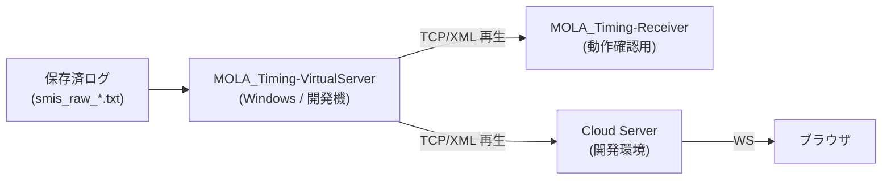

# MOLA_Timing-Receiver / MOLA_Timing-VirtualServer / Cloud 配信 開発計画

作成日: 2026年5月20日
対象遠征: 2026年6月第2週 岡山国際サーキット 実機接続テスト

---

## 0. 命名規則（重要）

| 文脈 | 名称 |
|------|------|
| ユーザー向け表示・配布名・exe ファイル名 | **MOLA_Timing-Receiver** / **MOLA_Timing-VirtualServer** |
| ソースコード・名前空間・型・変数・ファイル名 | **SMIS**（プロトコル仕様の正式名のため） |
| プロトコル参照 | SMIS（仕様書: `docs/Specification/計測データ仕様書_20200220.pdf`） |
| ログファイル名 | `smis_raw_YYYYMMDD.txt` / `smis_parsed_YYYYMMDD.txt` |

> 「対外的には MOLA_Timing 規格のレシーバー、内部実装は SMIS プロトコル準拠」という二重の整理。下請けとしての RFX Timing の存在を露出させない方針はそのまま継続。

---

## 1. ゴール

1. **2026年6月第2週の遠征で MOLA 計測サーバーに接続し、実走行のログを完全に保存して持ち帰る** ことを最優先とする
2. ログは「最も重要な開発資産」として、生 XML レベルまで保存し、後からどのフォーマット変更にも追従可能にする
3. 持ち帰ったログを使って、開発環境で SMIS を再現できる **MOLA_Timing-VirtualServer** を後追いで実装する
4. クラウド配信は **Receiver → Cloud → ブラウザ** の 3 段構成を想定しつつ、6月時点ではクラウドなしでも Receiver 単体で動作できる構成にする

---

## 2. アプリ構成

3 つの成果物に分割し、共通処理は単一の Core ライブラリに集約する。

```
RFX-LiveTiming-OKAYAMA/
├── frontend/                       (既存 Next.js — Phase 1 完了済)
├── server/                         (将来の Cloud Server, Node.js — Phase 4)
└── windows/
    └── RfxTiming.sln
        ├── RfxTiming.Smis.Core             (.NET 10 クラスライブラリ)
        │   ├── Protocol/                    NULL 終端ストリーム分割
        │   ├── Xml/                         SMIS XML パーサー
        │   ├── Messages/                    SMIS DTO 型定義
        │   ├── Logging/                     ファイル出力・ローテーション
        │   ├── Persistence/                 SQLite 設定・メタ DB
        │   ├── Networking/                  TCP クライアント / WS サーバー
        │   └── Replay/                      ログ再生エンジン
        ├── RfxTiming.Smis.Receiver         (.NET 10 WPF — AssemblyName: MOLA_Timing-Receiver.exe)
        └── RfxTiming.Smis.VirtualServer    (.NET 10 WPF — AssemblyName: MOLA_Timing-VirtualServer.exe)
```

### 2.1 技術スタック

| 項目 | 採用 | 理由 |
|------|------|------|
| ランタイム | .NET 10 (LTS) | Windows ネイティブ・安定、2028 年 11 月までサポート |
| UI | WPF + MVVM (CommunityToolkit.Mvvm) | 業務系で実績多数、ツールバー・設定ダイアログ実装が容易 |
| XML パース | System.Xml.Linq | 標準ライブラリで十分、依存最小 |
| ローカル DB | SQLite (Microsoft.Data.Sqlite) | 軽量、単一ファイル、ZIP アーカイブと相性良し |
| WebSocket サーバー | ASP.NET Core Kestrel (WPF にホスト) | 標準・高信頼・既存フロントから接続容易 |
| TCP サーバー | System.Net.Sockets | VirtualServer 用、SMIS と完全同一プロトコル |
| 配布 | 単一実行 self-contained `.exe` | インストーラー不要、計時室 PC へコピーで動作 |

### 2.2 システム全体構成（6月遠征時）

```mermaid
flowchart LR
  MOLA["MOLA 計測サーバー<br/>(SMIS/TCP)"] -->|XML/UTF-8| Receiver["MOLA_Timing-Receiver<br/>(Windows / 計時室常駐)"]
  Receiver -->|Raw stream| FileRaw["smis_raw_20260612.txt"]
  Receiver -->|Parsed JSONL| FileJsonl["smis_parsed_20260612.txt"]
  Receiver -->|設定・メタ| LocalDb[("local.db<br/>(SQLite)")]
  Receiver -->|WebSocket :8080| LAN["LAN クライアント<br/>(ピット内ブラウザ)"]
  Receiver -->|WebSocket over VPN| Remote["リモート確認<br/>(東京)"]
  Receiver -. 将来 .->|HTTPS POST| Cloud["Cloud Server<br/>(VPS)"]
```

### 2.3 システム全体構成（開発・検証時）



---

## 3. MOLA_Timing-Receiver 仕様

### 3.1 機能要件

| 区分 | 機能 | 6月マスト |
|------|------|:--------:|
| 接続 | SMIS TCP 接続（host:port 設定可、自動再接続・指数バックオフ） | ◎ |
| 受信 | NULL (0x00) 終端で XML 分割、UTF-8 デコード | ◎ |
| 解析 | 全 SMIS メッセージ型を C# DTO にマッピング | ◎ |
| 保存 | 生 XML を `.txt` 追記保存（タブ区切り 1 メッセージ 1 行） | ◎ |
| 保存 | 解析済 JSONL を `.txt` 追記保存 | ◎ |
| 保存 | SQLite に主要テーブル（passings/standings/messages 等）をミラー | ○ |
| ローテ | 日付別ファイル `smis_*_YYYYMMDD.txt`（必須） | ◎ |
| ローテ | セッション別ファイル `smis_*_<sessionId>_YYYYMMDD_HHmmss.txt`（設定で ON/OFF） | ○ |
| 配信 | 内蔵 WebSocket サーバー（フロント直結用） | ◎ |
| 配信 | クラウド HTTP POST 送信（キュー・再送・無効化可） | ―（後日） |
| UI | ツールバー: File / Settings / View / Help | ◎ |
| UI | リアルタイムダッシュボード（メッセージ種別カウント、最新 Standings） | ◎ |
| UI | 接続状態インジケータ（緑/黄/赤） | ◎ |
| 通知 | 切断・パースエラーの音声/視覚アラート | ○ |

### 3.2 保存フォーマット詳細

**生 XML ログ** (`smis_raw_YYYYMMDD.txt`)

各 SMIS メッセージは NULL 終端でストリームから到着するが、ファイル保存時はテキスト編集可能にしたいので 1 メッセージ 1 行にする:

```
{ISO8601受信時刻}\t{バイト長}\t{エスケープ済XML本体}\n
```

例:
```
2026-06-12T13:45:23.1234567+09:00	342	<Passing LoopId="0" Time="935910" TeamId="38" .../>
```

XML 本体に含まれるタブ・改行は `\t`・`\n` にエスケープする（読み込み側で復元）。

**解析済 JSONL ログ** (`smis_parsed_YYYYMMDD.txt`)

```json
{"ts":"2026-06-12T13:45:23.1234567+09:00","type":"Passing","payload":{"loopId":0,"time":935910,"teamId":"38","driverNo":1,"passType":"N"}}
```

### 3.3 設定項目（SQLite に保存、UI から編集）

| カテゴリ | キー | 既定値 | 説明 |
|---------|------|--------|------|
| Connection | smis.host | `127.0.0.1` | SMIS サーバーホスト |
| Connection | smis.port | `5000` | SMIS サーバーポート |
| Connection | smis.autoReconnect | `true` | 自動再接続 |
| Connection | smis.reconnectMaxIntervalSec | `30` | 再接続間隔上限 |
| Logging | log.outputDir | `%AppData%/MOLA_Timing-Receiver/logs` | 出力ディレクトリ |
| Logging | log.format | `Both` | `RawOnly` / `ParsedOnly` / `Both` |
| Logging | log.rotation | `Daily` | `Daily` / `Session` / `DailyAndSession` |
| Logging | log.fileExtension | `txt` | `txt` / `jsonl` |
| Logging | log.mirrorPath | _(空)_ | USB 等への二重保存先（任意） |
| Distribution | ws.enabled | `true` | 内蔵 WS サーバー有効化 |
| Distribution | ws.port | `8080` | WS ポート |
| Distribution | ws.allowedOrigins | `*` | CORS / Origin 許可リスト |
| Cloud | cloud.enabled | `false` | クラウド送信有効化（6月は OFF） |
| Cloud | cloud.endpoint | _(空)_ | 送信先 URL |
| Cloud | cloud.apiKey | _(空)_ | API キー |
| Alert | alert.sound | `true` | 切断時音声 |

### 3.4 UI 画面

- **メインウィンドウ**
  - 上段: メニューバー（File / Settings / View / Help）+ ツールバー（接続/切断、開始/停止、設定ボタン）
  - 中段左: メッセージ種別カウント（Standings/Passing/Message/Master）
  - 中段右: 最新 Standings 簡易表示（上位 10 台）
  - 下段: ライブログビュー（最後 100 行）
  - ステータスバー: 接続状態、出力ファイル、本日メッセージ総数
- **設定ダイアログ**
  - タブ: Connection / Logging / Distribution / Cloud / Alert
- **ヘルプダイアログ**
  - SMIS プロトコル概要、保存場所、トラブルシュート

### 3.5 既存フロントエンド統合

Receiver 内蔵 WS サーバーは、現状フロントが想定している Socket.IO ではなく **ネイティブ WebSocket** で実装する。フロントエンド側の改修は別タスクで実施:

- フロントの WS クライアントを `new WebSocket(...)` ベースに変更
- LAN: `ws://<計時室PCのIP>:8080`
- VPN 越し: 同上（VPN クライアント経由）

---

## 4. MOLA_Timing-VirtualServer 仕様

### 4.1 機能要件

| 機能 | 内容 |
|------|------|
| ログ読込 | 生 XML `.txt` を優先、JSONL も可。複数ファイルの結合再生 |
| 配信 | TCP サーバーとして待ち受け、SMIS と同一プロトコルで配信 |
| 時刻通り再生 | 録画時の `ts` 差分どおりに送信 |
| 速度可変 | 0.5x / 1x / 2x / 5x / 10x / Max（バーストモード） |
| シーク | タイムライン上で任意の時刻にジャンプ。マスターデータは先頭から累積適用 |
| セッション選択 | `Select` メッセージを検出して頭出し可能 |
| ループ再生 | 区間 A-B を指定して繰り返し |
| 複数クライアント | 同時接続を許可（本来 SMIS は単方向だが、開発便宜上） |
| UI | 再生コントロール、タイムラインスライダー、接続クライアント一覧、メッセージレートグラフ |

### 4.2 シーク時の状態復元

SMIS はマスターデータ（Competition / Category / Team / Driver 等）が先頭付近にしか流れない。**シーク時はファイル先頭からマスターデータを抽出して必ず送信**してから、目的位置の計測データ再生を開始する。

```
[ファイル冒頭]
  Competition / Category / Session / Class / Team / Driver / Loop  ← 必ず先頭で全部送る
[目的位置]
  Standings / Passing / Message  ← ここから時刻通り再生
```

---

## 5. RfxTiming.Smis.Core 仕様（共通ライブラリ）

### 5.1 主要モジュール

| モジュール | 責務 |
|------------|------|
| `Protocol.SmisFrameReader` | NULL 終端ストリームから XML を切り出す |
| `Xml.SmisXmlParser` | XML → C# DTO へのマッピング（全メッセージ型対応） |
| `Messages.*` | DTO 型定義（C# レコード、SMIS 仕様準拠） |
| `Logging.RawLogWriter` | 生 XML を tab 区切り 1 行形式で追記 |
| `Logging.JsonlLogWriter` | 解析済データを JSONL で追記 |
| `Logging.LogRotator` | 日付・セッション境界でのファイル分割 |
| `Persistence.SettingsRepository` | SQLite 上の設定 CRUD |
| `Persistence.TimingMirrorRepository` | passings/standings 等のミラー DB アクセス |
| `Networking.SmisTcpClient` | 自動再接続付き TCP クライアント |
| `Networking.SmisTcpServer` | VirtualServer 用 TCP サーバー |
| `Networking.LiveWebSocketHub` | Receiver 用 WS サーバー（ASP.NET Core ホスト） |
| `Replay.LogReader` | 生 XML / JSONL ログの読込 |
| `Replay.ReplayScheduler` | 時刻通り・速度可変・シーク・ループのスケジューリング |

### 5.2 SMIS メッセージ型（C# 側）

仕様書に基づき、最低限以下を定義する（Phase 3 完成版）:

- マスター: `Competition`, `Category`, `Round`, `Group`, `Session`, `Class`, `Team`, `Driver`, `Transponder`
- 計測ポイント: `Loop`
- 計測: `Select`, `Start`, `Passing`, `Standings`
- メッセージ: `Message`

時刻はすべて 1/10000 秒の `long` で保持し、表示変換は呼び出し側で行う。

---

## 6. ログ品質保証（6月遠征に向けて）

実機接続テストを最大限有効にするため、以下を必ず満たす。

- **二重保存**: 生 XML と解析済 JSONL を同時保存し、片方が壊れてももう一方で復元可能
- **書き込みフラッシュ**: 各メッセージごとに `FlushAsync` を呼び、PC ハング時もロスを最小化
- **ファイルサイズ監視**: 100MB 超えで自動で連番ファイルへ分割（`smis_raw_20260612_01.txt`）
- **メタデータ別保存**: 各ログファイルとペアで `*.meta.json` を作成し、開始時刻 / 終了時刻 / メッセージ数 / SMIS host:port / Receiver バージョンを記録
- **チェックサム**: ファイルクローズ時に SHA-256 を計算し meta に記録（持ち帰り後の整合性確認用）
- **冗長化**: 設定で「USB ドライブにもミラー保存」を有効化可能（計時室 PC 故障対策）

---

## 7. 開発スケジュール

| 週 | 主要タスク |
|----|------------|
| **W1: 5/20-5/26** | `RfxTiming.sln` scaffold、Core の `SmisFrameReader`/`SmisXmlParser`/型定義、ユニットテスト |
| **W2: 5/27-6/2** | Receiver 本体（TCP→保存→ダッシュボード）、SQLite 設定、ローテーション、WS サーバー雛形 |
| **W3: 6/3-6/9** | Receiver UI 仕上げ、設定ダイアログ、既存フロント WS 接続切替、LAN/VPN 統合テスト |
| **6/8-6/14** | **岡山遠征：実機接続テスト、ログ収集** |
| W4: 6/15-6/21 | 持ち帰りログのレビュー、VirtualServer の Replay エンジン |
| W5: 6/22-6/28 | VirtualServer UI、シーク・ループ実装 |
| W6 以降 | Cloud Server（Node.js）設計・実装、Gap/Interval 計算、リザルト生成 |

---

## 8. リスクと対策

| リスク | 対策 |
|--------|------|
| 仕様書に載っていない SMIS メッセージが流れる | 生 XML を必ず保存することで後解析可能。未知タイプは `Unknown` として JSONL にも残す |
| MOLA 側ネットワーク仕様が当日変わる | 接続先 host:port を UI から即変更可能。ファイアウォール設定もチェックリスト化 |
| ログ書き込み失敗 | ディスク容量・権限チェックを起動時に実施、失敗時は赤アラート |
| WPF アプリのフリーズ | TCP 受信は別スレッド、UI は通知のみ受け取る MVVM 構造を厳守 |
| 計時室 PC が再起動される | 自動起動 (`HKCU\...\Run`) オプションを設定で有効化可能 |

---

## 9. 6月遠征前チェックリスト

- [ ] MOLA_Timing-Receiver を計時室 PC にコピーし、起動確認
- [ ] SMIS host:port の設定値を MOLA 側担当者と確認
- [ ] 出力ディレクトリの容量確認（最低 10GB 推奨）
- [ ] USB ミラー保存先の準備
- [ ] LAN ケーブル経由で別 PC のブラウザから WS 接続確認
- [ ] VPN 経由で遠隔から WS 接続確認
- [ ] 1 セッション分の擬似配信（VirtualServer 開発前なら手動 TCP echo でも可）でリハーサル
- [ ] 切断・再接続シナリオの動作確認
